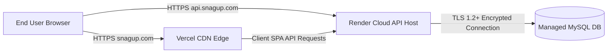

# Phase 10E DNS, HTTPS, CORS & Domain Integration Report

## 1. Domain Architecture & Request Flow



- **Frontend Production Domain**: `https://snagup.com` and `https://www.snagup.com`
- **Backend API Subdomain**: `https://api.snagup.com`
- **Database Transport**: Encrypted TLS 1.2+ connection over port `3306`

---

## 2. DNS Configuration Requirements

| Subdomain | Type | Target Value | Purpose |
|---|---|---|---|
| `@` (apex domain) | A / ALIAS | Vercel IP / `76.76.21.21` | Routes `snagup.com` to Vercel |
| `www` | CNAME | `cname.vercel-dns.com` | Routes `www.snagup.com` to Vercel |
| `api` | CNAME | `[YOUR_BACKEND_HOST].onrender.com` | Routes `api.snagup.com` to Render |

---

## 3. HTTPS & SSL/TLS Verification
- **Vercel Frontend**: Automatic SSL certificate issuance via Let's Encrypt / Vercel Edge.
- **Backend Cloud Host**: Automatic SSL certificate issuance via cloud provider for `api.snagup.com`.
- **Database Connection**: `DB_SSL=true` enforces TLS 1.2+ transport security between backend API and MySQL server.

---

## 4. Production CORS Configuration Requirements
In `backend/server.js`, CORS is configured to strictly enforce domain boundaries:
```javascript
const allowedOrigins = process.env.ALLOWED_ORIGINS
    ? process.env.ALLOWED_ORIGINS.split(',').map(o => o.trim())
    : ['http://localhost:3000', 'https://localhost:3000', process.env.FRONTEND_URL].filter(Boolean);
```

### Production Rules:
- Set `ALLOWED_ORIGINS=https://snagup.com,https://www.snagup.com` in backend host dashboard.
- Wildcard (`*`) is **disabled** for authenticated API routes.
- Preflight `OPTIONS` requests and `credentials: true` header settings are supported for Bearer token requests.

---

## 5. Manual Administrator Actions Required
- Add CNAME / A records in domain registrar DNS settings (GoDaddy / Cloudflare / Namecheap).
- Add `ALLOWED_ORIGINS=https://snagup.com,https://www.snagup.com` to backend environment variables.
- Add `FRONTEND_URL=https://snagup.com` to backend environment variables.

---

## 6. Status & Decision
### **STATUS: MANUAL ACTION REQUIRED (EXTERNAL DNS PROVIDER)**
### **DECISION: GO (DOMAIN & CORS PREPARATION COMPLETE)**
