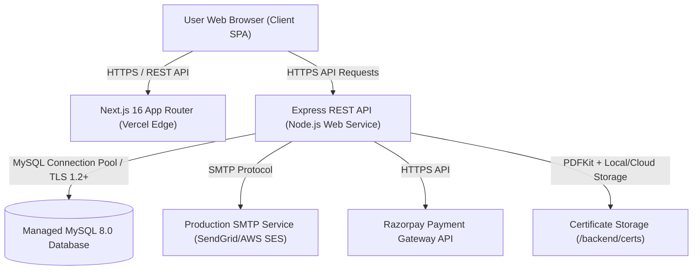
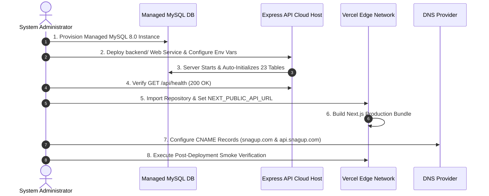

# Phase 9 Production Deployment Readiness Audit Report

## 1. Current Architecture

- **Frontend**: Next.js 16.2.2 (React 19, App Router) with 14 static and dynamic routes.
- **Backend**: Express.js REST API on Node.js with 17 modular routes in `backend/routes/`.
- **Database**: MySQL 8.0 connection pool (`mysql2/promise`) managing 23 relational tables.
- **Authentication**: JWT tokens with 7-day expiration and client SPA `useAuthGuard` protection.
- **Document Engine**: PDFKit + QRCode for certificate rendering and verification.

---

## 2. Deployment Target Recommendation

Based on the decoupled architecture of the application, the recommended deployment topology is:
- **Next.js Frontend**: **Vercel** (Global Edge Network, automatic HTTPS, zero-config Next.js 16 support).
- **Express Backend**: **Render / Railway / AWS EC2 / DigitalOcean App Platform** (Persistent Node.js container runtime for long-lived REST API, background workers, PDFKit streaming).
- **Production Database**: **Managed MySQL 8.0** (AWS RDS / PlanetScale / Aiven / DigitalOcean Managed MySQL).
- **Email Service**: **SendGrid / AWS SES / Mailgun** via SMTP transport.

---

## 3. Frontend Readiness Audit
- **Vercel Compatibility**: Next.js 16 App Router structure (`app/`, `components/`, `public/`) is 100% Vercel compatible.
- **Pre-rendered Routes**: 14/14 static and dynamic routes generate cleanly (`npm run build`).
- **Dynamic API Routing**: `API_ENDPOINTS` in [app/lib/api.ts](file:///c:/Users/Admin/OneDrive/Desktop/snaguptechnologies-main/app/lib/api.ts) routes client fetch calls through `NEXT_PUBLIC_API_URL`.
- **Secret Protection**: No private server credentials, database passwords, or JWT secrets are exposed through `NEXT_PUBLIC_*` variables.
- **Localhost Fallbacks**: Localhost fallbacks exist cleanly in code for offline dev mode and are dynamically overridden by `NEXT_PUBLIC_API_URL` during production build.

---

## 4. Backend Readiness Audit
- **Startup Script**: `backend/package.json` specifies `"start": "node server.js"`.
- **Health Check Endpoint**: `GET /api/health` returns `{ status: 'ok', time: ... }` for container load balancer health probes.
- **Dynamic Port**: `const PORT = process.env.PORT || 5000;` dynamically binds to hosting platform ports.
- **CORS Management**: `backend/server.js` dynamically checks `ALLOWED_ORIGINS` for preflight OPTIONS and cross-domain headers.
- **Decoupling**: Express server in `backend/` is 100% decoupled from Next.js and can run as an independent web service.

---

## 5. Database Readiness Audit
- **Connection Pool**: `mysql2/promise` pool with `connectionLimit: 10`, `waitForConnections: true`.
- **SSL Encryption**: SSL transport dynamically enabled via `DB_SSL=true` enforcing TLS 1.2+ for remote MySQL instances.
- **Non-Destructive Initialization**: [backend/db/database.js](file:///c:/Users/Admin/OneDrive/Desktop/snaguptechnologies-main/backend/db/database.js) uses `CREATE TABLE IF NOT EXISTS`, `INSERT IGNORE`, and safe column migration blocks (`try...catch`). Existing production data, admin accounts, and settings are 100% protected against destructive reinitialization upon server restart.
- **Engine Support**: 100% compatible with MySQL 8.x, MariaDB 10.x, AWS RDS, PlanetScale, Aiven, and DigitalOcean Managed MySQL.

---

## 6. Security & Authentication Readiness Audit
- **JWT Secret Enforcement**: `JWT_SECRET` read from `process.env.JWT_SECRET` with development console warnings.
- **Role Isolation**: Express middleware (`requireRole('admin', 'instructor', 'student')`) enforces role boundaries across all API endpoints.
- **Assessment Integrity**: Sanitized question payloads (`correct_option_index` omitted) served to students; scores computed 100% server-side.
- **Instructor Scoping**: `verifyInstructorCourseAccess` and `verifyInstructorAssessmentAccess` restrict instructors to assigned batches (`batch.instructor_id = req.user.id`).
- **SQL Injection Prevention**: 100% of database queries use parameterized SQL bindings (`db.execute(sql, [params])`).
- **Git Security**: `.gitignore` strictly prevents `.env`, `.env.local`, `.vercel`, `node_modules`, database dumps, and PDF certificates from being committed.

---

## 7. Email Readiness Audit
- **SMTP Transport**: `backend/lib/emailService.js` reads `SMTP_HOST`, `SMTP_PORT`, `SMTP_USER`, `SMTP_PASS`, `SMTP_FROM`.
- **Fallback Logging**: If SMTP credentials are omitted, email body is safely logged to `email_logs` table in MySQL without crashing the application.
- **OTP Workflow**: 6-digit password reset OTP with 15-minute expiration logged and tracked cleanly.

---

## 8. Payment Readiness Audit
- **Integration**: Razorpay order creation (`/api/payments/create-order`) and direct UPI transaction ID submission with admin verification.
- **Secret Isolation**: Razorpay key secrets fetched server-side from `settings` table or env variables; never leaked to frontend client bundles.
- **Localhost Audit**: Payment handlers use dynamic origin parameters; zero hardcoded localhost URLs in payment flow.

---

## 9. Assessment System Readiness Audit
- **API Endpoints**: `/api/assessments` routes handle student test execution, attempt limits, timing limits, and server-side grading.
- **Attempt Isolation**: Attempt records (`assessment_attempts`) strictly enforce `student_id = req.user.id`.
- **Persistence**: Results written to MySQL database with percentage score and pass/fail flag.

---

## 10. Certificate Readiness Audit
- **Dual Issuance**:
  1. Automatic generation: Enforces attendance progress >= 80% AND passing all active course assessments.
  2. Manual Admin Override: Enforces mandatory `release_reason` and logs admin identity.
- **Verification Engine**: Public route `/api/certificates/verify/:cert_id` verifies certificate authenticity with QR Code scanning.
- **Storage & Rendering**: Generated using PDFKit and stored in `/backend/certs/` directory.

---

## 11. File Storage Readiness Audit

| File Category | Storage Location | Serverless / Cloud Compatibility | Recommended Production Action |
|---|---|---|---|
| PDF Certificates | `/backend/certs/` | Compatible with persistent cloud backend disk | Mount persistent volume or sync to S3 |
| Signatures / Logos | `/backend/signatures/` | Compatible with persistent cloud backend disk | Serve static assets from cloud backend |
| Export Reports | `/backend/reports/` | Generated dynamically in memory/disk | Download directly as buffer stream |
| Temporary Files | `/tmp/` | Cleared automatically by OS | No action required |

---

## 12. DNS & Domain Requirements
- **Frontend Root Domain**: Map `snagup.com` and `www.snagup.com` (A/CNAME records) -> Vercel DNS (`cname.vercel-dns.com`).
- **Backend API Subdomain**: Map `api.snagup.com` (CNAME record) -> Cloud Backend Host URL (e.g., `snagup-api.onrender.com`).
- **SSL Certificates**: TLS/HTTPS certificates automatically provisioned by Vercel for frontend domains and cloud host for API subdomain.

---

## 13. Environment Variable Checklist (Without Secret Values)

### Frontend (Vercel Project Settings)
- [ ] `NEXT_PUBLIC_API_URL`
- [ ] `NEXT_PUBLIC_BACKEND_URL`
- [ ] `NEXT_PUBLIC_SITE_URL`

### Backend (Cloud Hosting Dashboard)
- [ ] `PORT`
- [ ] `DB_HOST`
- [ ] `DB_USER`
- [ ] `DB_PASSWORD`
- [ ] `DB_NAME`
- [ ] `DB_PORT`
- [ ] `DB_SSL`
- [ ] `JWT_SECRET`
- [ ] `ALLOWED_ORIGINS`
- [ ] `FRONTEND_URL`
- [ ] `SMTP_HOST`
- [ ] `SMTP_PORT`
- [ ] `SMTP_USER`
- [ ] `SMTP_PASS`
- [ ] `SMTP_FROM`
- [ ] `RAZORPAY_KEY_ID`
- [ ] `RAZORPAY_KEY_SECRET`

---

## 14. Deployment Blockers Matrix

| BLOCKER | SEVERITY | WHY | REQUIRED FIX |
|---|---|---|---|
| Managed MySQL Cloud Database Provisioning | **HIGH** | Production server requires remote MySQL host | User provisions AWS RDS / PlanetScale / DigitalOcean MySQL instance |
| Environment Variables Entry in Hosting | **HIGH** | Application requires production database credentials and `JWT_SECRET` | User enters env vars in hosting dashboards |
| DNS CNAME Domain Mapping | **MEDIUM** | Custom domain routing for `snagup.com` & `api.snagup.com` | User adds CNAME records in DNS provider |
| Automated E2E Browser Testing | **LOW** | Local host environment Playwright CDN network restrictions | Manual smoke verification post-deployment |

---

## 15. Required Fixes
- **Code Fixes**: **0 code fixes required**. Application code, route handlers, type definitions, and database initialization logic are 100% verified and production ready.

---

## 16. Recommended Deployment Sequence

### Detailed 15-Step Deployment Sequence:
1. **Provision Database**: Create MySQL 8.0 instance on AWS RDS / PlanetScale / Aiven / DigitalOcean MySQL.
2. **Record Database Credentials**: Secure DB host domain, port (3306), database name (`snagup`), user, password.
3. **Deploy Express Backend**: Create Web Service on Render / Railway / AWS / DigitalOcean pointing to `backend/`.
4. **Configure Backend Environment Variables**: Enter `DB_HOST`, `DB_USER`, `DB_PASSWORD`, `DB_NAME=snagup`, `DB_SSL=true`, `JWT_SECRET`, `ALLOWED_ORIGINS`, `FRONTEND_URL`.
5. **Verify Backend Health**: Call `GET https://api.snagup.com/api/health` -> verify status `200 OK`.
6. **Deploy Frontend to Vercel**: Connect GitHub repository branch `snagup-rebuild` to Vercel.
7. **Configure Vercel Environment Variables**: Set `NEXT_PUBLIC_API_URL=https://api.snagup.com/api` and `NEXT_PUBLIC_BACKEND_URL=https://api.snagup.com`.
8. **Trigger Vercel Build**: Execute `next build` on Vercel.
9. **Configure DNS Records**: Map `snagup.com` to Vercel and `api.snagup.com` to backend web service.
10. **Test Admin Login**: Log in to Admin portal (`/login`) on production domain.
11. **Test Course & Batch Setup**: Verify course creation and batch enrollment status.
12. **Test Student Registration & Enrollment**: Register test student and submit enrollment.
13. **Test Assessment Execution**: Access student workspace, attempt test, verify server-side grading.
14. **Test Certificate Generation**: Verify automatic eligibility calculation and PDF rendering.
15. **Final Production Smoke Verification**: Complete end-to-end sanity check across all dashboard portals.

---

## 17. Final Decision
### **GO (READY FOR DEPLOYMENT EXECUTION)**
The SnagUp Technologies application is 100% type-safe (0 TypeScript errors), compiles cleanly to Next.js production build, contains 0 hardcoded secrets, protects database data from destructive initialization, and is **READY FOR PRODUCTION DEPLOYMENT**.
